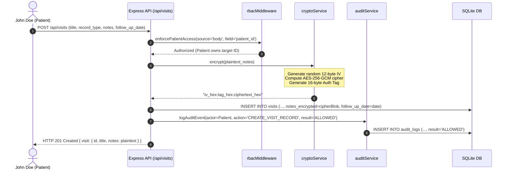
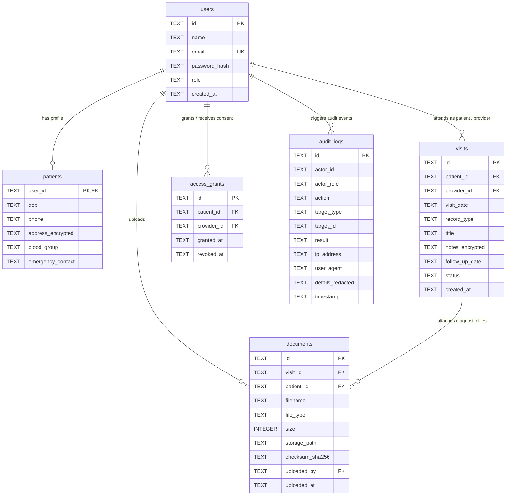

# Architecture Specification: SecurePHR Platform
## Challenge ID: HT-05 | URAN 2026 HealthTech Track

---

## 🏗️ High-Level System Architecture

```text
+---------------------------------------------------------------------------------------+
|                                CLIENT TIER (React + Vite)                             |
|  - Modern Dark HealthTech UI (TailwindCSS)     - Live 6-Step Hackathon Demo Navigator |
|  - 1-Click Synthetic Persona Switcher          - Role-Aware Context & Urgency Banners  |
+---------------------------------------------------------------------------------------+
                                           |
                                  HTTPS / REST JSON
                                           v
+---------------------------------------------------------------------------------------+
|                               API GATEWAY & SECURITY LAYER                             |
|  - CORS & Rate Limiting (express-rate-limit)                                          |
|  - Privacy Logger: Strips PII / passwords / bearer tokens prior to console stdout     |
|  - JWT Authentication Middleware: Validates cryptographic signature & expiry          |
+---------------------------------------------------------------------------------------+
                                           |
                                           v
+---------------------------------------------------------------------------------------+
|                            CONSENT-GATED RBAC ENGINE                                  |
|                              (rbacMiddleware.js)                                      |
|                                                                                       |
|   [Actor: Patient]                     [Actor: Provider]                              |
|   -> Target == Self?                   -> Active Consent in access_grants?            |
|       YES: Proceed                         YES: Proceed                               |
|       NO : 403 FORBIDDEN                   NO : 403 FORBIDDEN (CONSENT_NOT_GRANTED)   |
|            -> Log DENIED                        -> Log DENIED to Audit Trail          |
+---------------------------------------------------------------------------------------+
                                           |
                                           v
+---------------------------------------------------------------------------------------+
|                                  DOMAIN LAYER                                         |
|  - AES-256-GCM Cipher Service: Random 96-bit IV, 128-bit Auth Tag, SHA-256 key derive |
|  - Follow-up Urgency Engine: Calculates days remaining, overdue status, banner alert  |
|  - Document Metadata Ingestion: Computes SHA-256 checksum, strips binary from logs    |
+---------------------------------------------------------------------------------------+
                                           |
                        +------------------+------------------+
                        |                                     |
                        v                                     v
+------------------------------------+    +------------------------------------+
|       RELATIONAL STORAGE TIER      |    |       OBJECT STORAGE TIER          |
|          (phr_data.sqlite)         |    |        (data/uploads/)             |
|                                    |    |                                    |
|  - users (bcrypt hashed passwords) |    |  - UUID-isolated binary documents  |
|  - patients (AES-256 addresses)    |    |  - Strict MIME-type segregation    |
|  - visits (AES-256 clinical notes) |    |  - Zero raw payloads in databases  |
|  - access_grants (consent table)   |    +------------------------------------+
|  - documents (file metadata only)  |
|  - audit_logs (append-only ledger) |
+------------------------------------+
```

---

## 🔄 Core Data Flows & Sequences

### 1. Consent Verification & "Access Denied" Execution Flow (Winning Angle)

```mermaid
sequenceDiagram
    autonumber
    actor Provider as Dr. Priya Sharma (Provider)
    participant API as Express API (/api/visits)
    participant RBAC as rbacMiddleware
    participant Consent as consentService
    participant Audit as auditService
    participant DB as SQLite DB

    Provider->>API: GET /api/visits?patient_id=Sarah_Smith_ID
    API->>RBAC: enforcePatientAccess(source='query', field='patient_id')
    RBAC->>Consent: hasActiveConsent(patientId, providerId)
    Consent->>DB: SELECT * FROM access_grants WHERE patient_id=? AND provider_id=? AND revoked_at IS NULL
    DB-->>Consent: NULL (No active grant found)
    Consent-->>RBAC: false (Unapproved)
    
    rect rgb(60, 20, 20)
    Note over RBAC,Audit: CENTERPIECE MOMENT: Access Intercepted Server-Side
    RBAC->>Audit: logAuditEvent(actor=Provider, result='DENIED', action='VIEW_PATIENT_RECORD_UNAUTHORIZED')
    Audit->>DB: INSERT INTO audit_logs (..., result='DENIED', timestamp=NOW)
    RBAC-->>Provider: HTTP 403 Forbidden { code: 'CONSENT_NOT_GRANTED', audit_logged: true }
    end
```



### 2. Patient Data Creation & AES-256 Encryption Flow



---

## 🗄️ Relational Schema Design



---

## 🛡️ Subsystem Component Specifications

### 1. Client Presentation Tier (`frontend/`)
- Built with **React 18 + Vite + Tailwind CSS**.
- **Interactive Hackathon Showcase Bar (`DemoGuideBar.jsx`)**: Positions an explicit 6-step walkthrough at the top of the interface so judges can evaluate compliance in under 3 minutes.
- **Access Denied Modal (`AccessDeniedModal.jsx`)**: Captures and highlights unauthorized clinical access attempts with complete technical diagnostics.
- **AES-256 Ciphertext Inspector**: Permits immediate switching between decrypted clinical notes and the underlying ciphertext stored on disk.

### 2. Zero-Trust Access & Consent Controller (`rbacMiddleware.js`)
- Enforces strict server-side authorization. Hidden UI buttons are considered insufficient; all API calls perform live lookups in `access_grants`.
- If `revoked_at IS NOT NULL`, the grant is legally nullified.
- Cross-patient requests by patients are intercepted and tagged as security violations.

### 3. Cryptographic Domain Layer (`cryptoService.js`)
- Utilizes native Node.js `crypto` with hardware-accelerated AES-NI instructions.
- Authenticated Galois/Counter Mode (GCM) guarantees that any tampering with ciphertext in the database generates an immediate decipher exception.
- Derives a 32-byte key from the `AES_256_SECRET_KEY` environment variable using SHA-256.

### 4. Append-Only Audit Ledger (`auditService.js`)
- Records all actions regardless of whether the HTTP response is `200 OK` or `403 Forbidden`.
- Every entry stores actor identity, role, target, action type, IP address, and redacted operational summary.
- The SQLite table has no update or delete routes, preserving forensic integrity.
